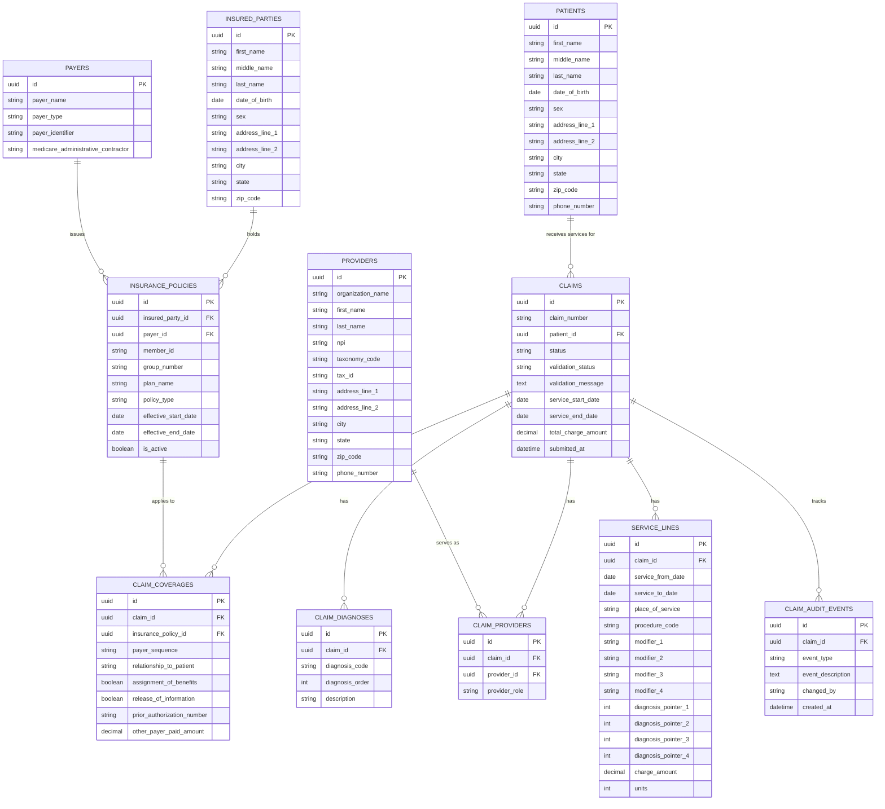

# CMS-1500 Claim Capture ERD

The following ERD shows the current normalized database design for CMS-1500 professional claim capture.



## Key Relationship Update

The insurance relationship is modeled through two tables:

```text
InsuredParty -> InsurancePolicy <- Payer
Claim -> ClaimCoverage -> InsurancePolicy
```

This avoids forcing a claim to have only one direct payer and allows future support for primary, secondary, and tertiary coverage.
