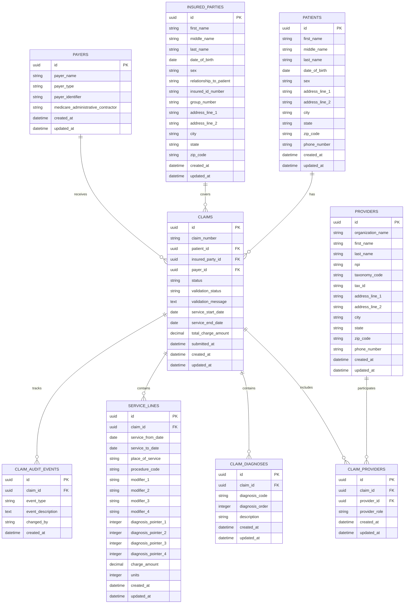

# CMS-1500 Capture ERD

This document provides the initial Mermaid ERD for the CMS-1500 claim capture database design.

The current schema direction uses UUID primary keys for internal database identity. Business identifiers such as NPI numbers, payer identifiers, ICD-10 codes, CPT codes, and HCPCS codes are stored as data fields rather than primary keys.

## Entity Relationship Diagram

## Design Notes

- A claim belongs to one patient, one insured party, and one payer.
- A claim can include multiple providers through claim_providers.
- A claim can include multiple ICD-10 diagnosis codes.
- A claim can include multiple CMS-1500 service lines.
- Service lines include diagnosis pointers so procedures can be linked back to diagnosis entries.
- Claim audit events support traceability during claim creation, editing, validation, and future submission workflows.
- This ERD is an initial design and may be refined after mentor feedback or implementation testing.
